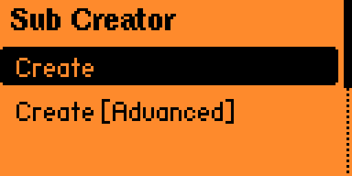
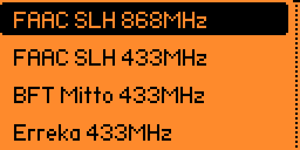

# 📡 Sub-GHz Sub Creator

A simple Flipper Zero application for generating and saving custom Sub-GHz key files directly on the device.

## ✨ Features
- Generate Sub-GHz `.sub` key files
- Support for multiple protocol configurations
- Customizable key parameters
- Built-in save system for generated keys
- Simple and lightweight UI optimized for Flipper Zero
- Designed for quick testing and experimentation

## 📸 Screenshots
<p align="center">
  
  
  
</p>

## 📥 Installation
### Using qFlipper
1. Download the latest release archive from the [GitHub Releases](https://github.com/Flipper-Hack/flipper-sub-creator/releases) page.
2. Extract the archive.
3. Open the folder matching your firmware.
4. Inside, locate the sub_creator.fap file.
5. Connect your Flipper Zero to your computer.
6. Open qFlipper.
7. Copy sub_creator.fap to: `/ext/apps/Sub-GHz/`
8. Launch the app from: `Apps -> Sub-GHz -> Sub Creator`

### Manual Build
```bash
git clone https://github.com/Flipper-Hack/flipper-sub-creator
cd sub-creator
ufbt
# Output: dist/sub_creator.fap
```

## 🚀 Usage
1. Open the app on your Flipper Zero.
2. Choose one of the available modes:
	- Create — generates all key data automatically using random values.
	- Create [Advanced] — allows manual configuration of generation parameters.
3. In Advanced Mode, you can configure values such as:
	- Key value
	- Serial
	- Counter
	- Seed
	- Button
4. Generate the Sub-GHz file.
5. Save the generated key.
6. Use the file through the standard Sub-GHz app.

## 📂 Project Structure
```
helpers/   - Key generation and protocol logic
scenes/    - Application UI scenes
keystore/  - Key Storage
```

## ✅ Compatibility
- Flipper Zero
- Only the Unleashed and Momentum firmware

## ⚠️ Disclaimer
This project is intended for:
- Educational purposes
- Hardware research
- Testing and development
- Interoperability experiments

Use this software responsibly and only with devices and systems you own or are authorized to test.

## 🤝 Contributing
Pull requests, issues, and suggestions are welcome.

If you find bugs or want to improve protocol support, feel free to open an issue.